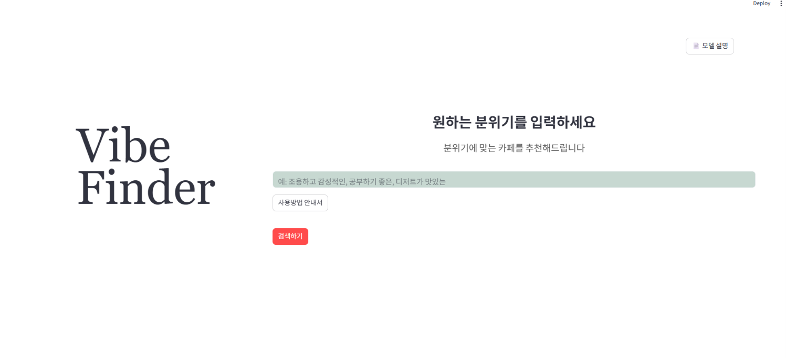
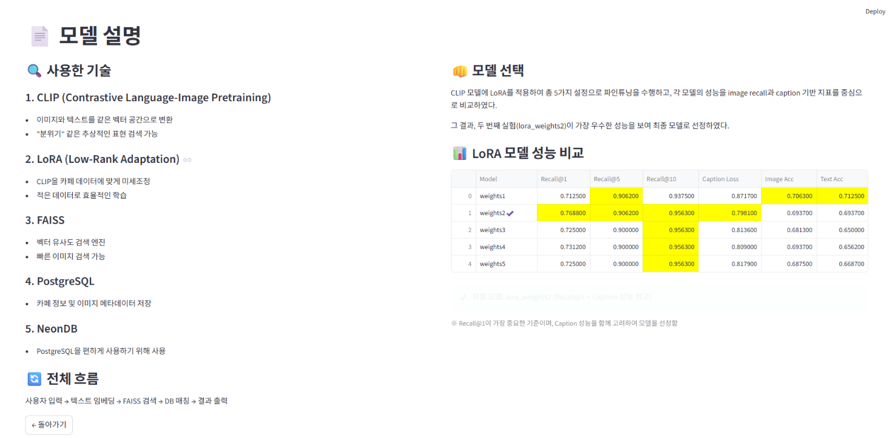
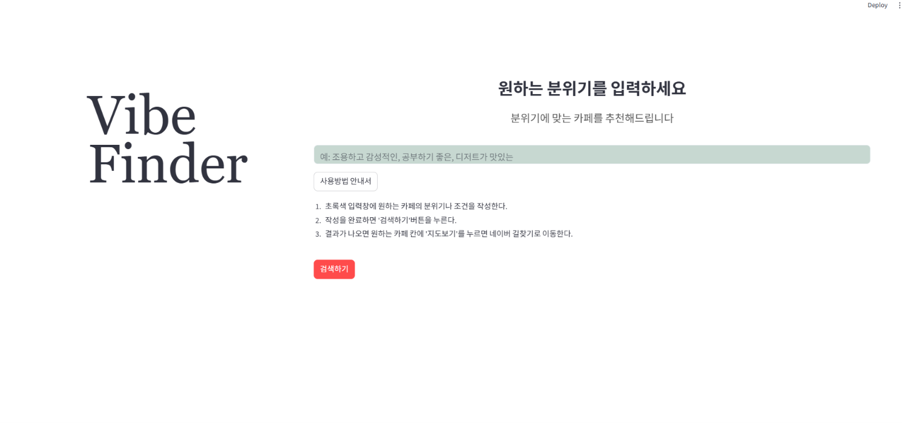
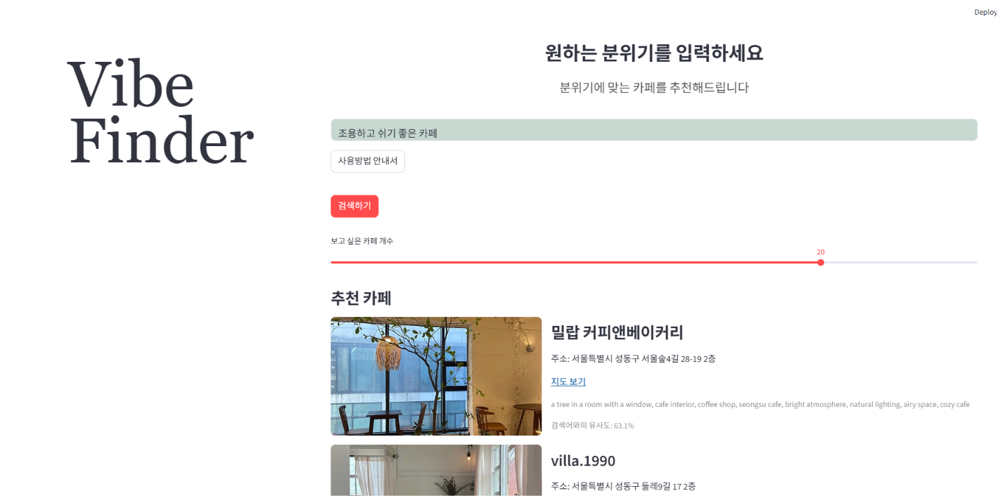
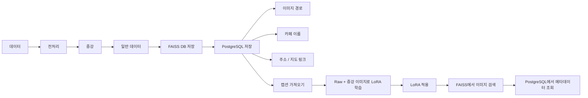

# AdvancedComputerVision_VibeFinder

## 해당 프로젝트는 고급컴퓨터비전 기말고사 대체 프로젝트로 진행되었음

## 프로젝트 소개
- 본 프로젝트의 이름은 ‘Vibe Finder’이며, 사용자가 “조용하고 감성적인 카페”, “공부하기 좋은 밝은 카페”처럼 자연어로 원하는 분위기를 입력하면 해당 분위기와 시각적으로 유사한 카페 이미지를 검색하고 추천하는 서비스이다. 일반적인 객체 탐지 모델처럼 특정 물체의 Bounding Box를 찾는 방식이 아니라, CLIP 기반 이미지-텍스트 임베딩을 사용하여 텍스트와 이미지가 같은 벡터 공간에서 비교되도록 설계하였다. 이후 카페 이미지 데이터에 맞게 LoRA 방식으로 CLIP 모델을 미세조정하고, 이미지 임베딩은 FAISS 인덱스에 저장하여 빠른 검색이 가능하도록 구현하였다. 추천 결과는 Streamlit UI에서 이미지, 카페명, 주소, 네이버 지도 링크, 이미지 캡션과 함께 제공된다.

### 해결하고자 하는 문제
- 기존 검색은 '제주도 카페' 같은 지역/카테고리 중심이라 사용자가 원하는 '특정한 분위기'를 찾으려면 수많은 블로그를 직접 확인해야 하는 피로감이 있음.
- 현재의 키워드 검색 (예: 조용한 카페 등)은 태그 기반이라 실제 장소의 분위기를 반영하지 못함.
- 일반적인 CLIP 모델은 서구권 데이터로 학습되어 한국의 분위기/느낌을 완벽히 잡지 못할 수 있음. 

### 최종 목표
- 자연어 입력(예: "빈티지하고 따뜻한 느낌의 골목길")을 통해 분위기에 부합하는 성수 카페 추천. 
- LoRA 학습을 통해 '감성 카페', ‘공부하기 좋은 곳' 등 특정 분위기 키워드가 반영된 텍스트-이미지 유사도 정교화 
- Streamlit 웹 UI를 통해 검색 결과와 해당 스팟의 촬영 팁을 함께 시각화. 
- 사용자는 친구에게 말하듯 (예: 나 오늘 레트로한 느낌의 카페에 가고 싶어) 검색하고, 그 문장에 가장 부합하는 사진을 제공받을 수 있음.
- LoRA의 미세 조정을 활용하여 한국 특유의 로컬 감성을 찾아내고자 함.

### 실행 화면






## 프로젝트 흐름
사용자 텍스트 쿼리 → CLIP Text Encoder → 벡터 변환 → FAISS Vector DB 내 이미지 벡터와 코사인 유사도 비교 → 가장 유사도가 높은 여행지 이미지 및 관련 태그 UI 출력 

## 역할 분담
- 김소연
	- 팀원을 도와 데이터를 수집함으로써 lora 학습의 밑바탕을 제공	
	- 데이터 전처리 및 증강
	- 이미지 캡션 생성-초기
	- CLIP 모델 불러오기 및 전이학습
	- Streamlit 화면 구성
- 이연우
	- 데이터를 수집함으로써 lora 학습의 밑바탕을 제공
	- postgresql(neon)으로 이미지 제외한 나머지 정보 저장 할 수 있도록 함
    - 이미지 캡션 생성-보완
	- faiss db 구축으로 자연어 입력 시 알맞는 이미지를 잘 조회할 수 있도록 함
	- 네이버 api연결하여 데이터 크롤링

## 개발 환경 및 의존성

### 개발 환경
- Python 3.13 (3.13.7)
- OS: Windows 11 (다른 OS에서도 동작 가능)
- PyTorch는 CPU 버전(`torch==2.12.0+cpu`)으로 설치되어 있으며, GPU(CUDA) 환경에서는 자동으로 GPU를 사용함.

### 핵심 라이브러리
- **streamlit** 1.57.0 — 웹 UI
- **torch** 2.12.0+cpu, **torchvision** 0.27.0 — CLIP 모델 실행
- **transformers** 5.8.1, **peft** 0.19.1 — CLIP + LoRA 파인튜닝 모델 로드
- **faiss-cpu** 1.13.2 — 이미지 임베딩 유사도 검색
- **psycopg2-binary** 2.9.12 — PostgreSQL(Neon) 연동
- **google-generativeai** 0.8.6 — Gemini API를 통한 검색어 확장
- **selenium** 4.44.0, **undetected-chromedriver** 3.5.5 — 카페 이미지/정보 크롤링
- **python-dotenv** 1.2.2 — `.env` 환경변수 관리
- **pandas** 3.0.3, **numpy** 2.4.4, **pillow** 12.2.0 — 데이터 처리 및 이미지 가공

## 상세 설치/실행방법

### 사전 준비
- `.env` 파일은 보안을 위해 교수님의 덕성여대 이메일으로(kmlee) 드라이브 접근 권한을 부여하였습니다.

### 실행 방법

1. 레포 클론
   ```bash
   git clone [https://github.com/soyeoni0115/AdvancedComputerVision_VibeFinder.git]
   ```

2. 드라이브에서 다음 파일/폴더 다운로드: `faiss_vibe.index`, `paths.npy`, `data.zip`, `.env`, `lora_weights`
	-  ```bash
   드라이브 링크 [https://drive.google.com/drive/folders/147kOYPKwi4XH3OAoRfpE93XxcXX1hIQM?usp=drive_link]
   ```
   - `faiss_vibe.index`, `paths.npy`, `.env` → 프로젝트 루트에 위치
   - `data.zip` 압축 해제 후 나온 `raw` 폴더 → `data/raw`에 위치
   - `lora_weights` 폴더 중 lora_weights2 → `models/lora_weights2`에 위치

3. 가상환경 생성 및 활성화
   ```bash
   python -m venv venv
   venv\Scripts\activate
   ```

4. 패키지 설치
   ```bash
   pip install -r requirements.txt
   ```

5. 앱 실행
   ```bash
   streamlit run src/app.py
   ```

6. 웹 화면에서 자연어로 원하는 카페 분위기를 입력한 후 **검색하기** 버튼 클릭

7. 검색 결과가 표시되면 왼쪽에는 카페 이미지, 오른쪽에는 카페 이름, 주소, 지도 보기(길찾기) 링크, 유사도가 함께 출력됨

## 데이터 파이프라인

데이터 -> 전처리 -> 증강 -> 일반 데이터 faiss db에 넣기
	  -> PostgreSQL(neon)에 이미지 데이터 경로, 이미지(카페) 이름, 데이터 파일명, 카페 주소, 카페 길찾기 연결 등 streamlit과 lora 학습에 필요한 정보들을 저장 
	=> PostgreSQL에서 캡션을 가져와 raw이미지와 증강 이미지를 사용해 lora 학습
	=> lora가 켜지면 faiss db에서 이미지 데이터를 가져오고 이미지에 맞는 정보를 불러옴

